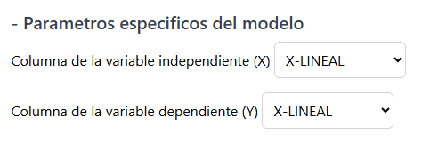

# Autor

| Carné     | Nombre                       | Nombre del Proyecto        |
|-----------|------------------------------|-----------------------------|
| 201612326 | Eddy Arnoldo Reyes Hernández | Proyecto 2 - IA1           |

# Indice

## Manual de usuario
1. [Paso 1: Cargar el dataset](#paso-1-cargar-el-dataset)
2. [Paso 2: Selección del modelo de inteligencia artificial](#paso-2-selección-del-modelo-de-inteligencia-artificial)
3. [Paso 3: Parametrización del modelo](#paso-3-parametrización-del-modelo)
   - [Parámetros generales](#parámetros-generales)
   - [Parámetros específicos del modelo](#parámetros-específicos-del-modelo)
4. [Paso 4: Uso del modelo](#paso-4-uso-del-modelo)

## Manual técnico
1. [Contenido del Script](#contenido-del-script)
   - [Variables](#variables)
   - [Funciones](#funciones)
     - [`trainModel()`](#trainmodel)
     - [`predictModel()`](#predictmodel)
2. [Descripción de los Modelos](#descripción-de-los-modelos)
   - [Regresión Lineal](#regresión-lineal)
   - [Regresión Polinómica](#regresión-polinómica)
   - [Árbol de Decisión](#árbol-de-decisión)
   - [Naive Bayes](#naive-bayes)
   - [Redes Neuronales](#redes-neuronales)
   - [K-Means](#k-means)
3. [Clases](#clases)
   - [`class CsvController`](#class-csvcontroller)
   - [`class LinearRegressionAdapter`](#class-linearregressionadapter)
   - [`class PolynomialRegressionAdapter`](#class-polynomialregressionadapter)
   - [`class DecisionTreeID3Adapter`](#class-decisiontreeid3adapter)
   - [`class NaiveBayesAdapter`](#class-naivebayesadapter)
   - [`class NeuralNetworkAdapter`](#class-neuralnetworkadapter)
   - [`class G8_KmeansAdapter`](#class-g8_kmeansadapter)

## Manual de usuario

### PASO 1: Cargar el dataset

Es necesario cargar un archivo CSV con toda la inforamcion a ser utilizada para cada uno de los modelos de IA que se utilizaran mas adelante, este CSV necesita tener encabezados en cada una de sus columnas y estos deben de ser unicos, es decir que no pueden haber encabezados repetidos

Se proporciona un archivo CSV de pruebas llamado `ArchivoEntrada.csv`, el cual se puede utilizar para probar la herramienta

### PASO 2: Selección del modelo de inteligencia artificial

Es necesario seleccioar el modelo de inteligencia artificial que se utilizará para analizar la información que se encuentra dentro del archivo, cada modelo de inteligencia artificial utiliza la implementación de la librería `tytus.js`, por lo que se clasifican estos modelos segun el enfoque que proporciona la libreria:

| Modelo de IA           | Propósito de uso                                |
|------------------------|-------------------------------------------------|
| Linear Regression      | Identificación de tendencias                    |
| Polynomial Regression  | Identificación de tendencias                    |
| Naive Bayes            | Realización de predicciones                     |
| Neural Networks        | Realización de predicciones                     |
| Decision Trees         | Organización de la información mediante patrones|
| K-means                | Organización de la información mediante patrones|

Cada modelo necesita que la información del CSV contenga una estructura particular, además de poseer parámetros distintos para su configuración. La explicación de cómo utilizar cada modelo se aborda mas adelante

### PASO 3: Parametrización del modelo

#### Parametros generales

Todos los modelos tienen un parámetro en común, siendo este la selección del porcentaje de Train Data y de Test Data que se utilizará. Estos valores están seteados por defecto de la siguiente manera, sin embargo es posible modificarlos haciendo uso del slider proporcionado:

    Train data: 80%
    Test data: 20%

#### Parametros especificos del modelo

Dependiendo del modelo utilizado, se solicitarán algunos parámetros adicionales, estos son los siguientes:

**Linear Regression**

| Parámetro                            | Descripción                                                        |
|--------------------------------------|--------------------------------------------------------------------|
| Columna de la variable independiente | Columna del CSV que representa la variable independiente           |
| Columna de la variable dependiente   | Columna del CSV que depende de la variable independiente           |

**Polynomial Regression**

| Parámetro                            | Descripción                                                        |
|--------------------------------------|--------------------------------------------------------------------|
| Columna de la variable independiente | Columna del CSV que representa la variable independiente           |
| Columna de la variable dependiente   | Columna del CSV que depende de la variable independiente           |

**Naive Bayes**

| Parámetro                                               | Descripción                                                          |
|---------------------------------------------------------|----------------------------------------------------------------------|
| Seleccione una columna                                  | Columna del CSV que se desea agregar al Dataset                      |
| ¿Qué variable predecir?                                 | Variable de los elementos del dataset que se desea analizar          |
| ¿Bajo de qué condiciones se desea predecir la variable? | Contexto sobre el cual se desea analizar la variable                 |

**Neural Networks**

| Parámetro                               | Descripción                                                      |
|-----------------------------------------|------------------------------------------------------------------|
| ¿Qué tipo de predicción desea realizar? | Indicar si se desea buscar el elemento mayor o el menor          |
| Elemento A                              | Valor numérico que conforma al elemento A                        |
| Elemento B                              | Valor numérico que conforma al elemento B                        |

**Decision Trees**

| Parámetro              | Descripción                                         |
|------------------------|-----------------------------------------------------|
| Seleccione una columna | Columna del CSV que se desea agregar al Dataset     |

**K-means**

| Parámetro                         | Descripción                                                    |
|-----------------------------------|----------------------------------------------------------------|
| Referencia en el eje X del punto  | Columna del CSV que representa el valor del punto en el eje X  |
| Referencia en el eje Y del punto  | Columna del CSV que representa el valor del punto en el eje Y  |
| Cantidad de centroides a calcular | Número de centroides que el modelo intentará clusterizar       |

### PASO 4: Uso del modelo

Utilizar los botones que se proporcionan para interactuar con el modelo, el orden seria el siguiente:

1. Entrenar
2. Predecir
3. Mostrar graficas

Sin embargo, no todos los modelos proporcionan estas funcionalidades, cuando esto ocurra se mostrará un mensaje indicandolo

**Boton Entrenar**

Realiza el entrenamiento del modelo de IA en base a la parametrización previamente realizada, los resultados del mismos se muestran en la zona de resultados

**Boton Predecir**

Realiza la prediccion de resultados del modelo de IA en base a la parametrización previamente realizada, los resultados del mismos se muestran en la zona de resultados

**Boton Mostrar Graficas**

Muestra las graficas generadas por el procesod e entrenamiento y de prediccion de datos del modelo seleccionado

## Manual tecnico

Este manual describe la implementación de varios modelos de predicción utilizando JavaScript y técnicas de Machine Learning. Los modelos incluyen regresión lineal, regresión polinómica, árboles de decisión, Naive Bayes, redes neuronales y K-means. 

### Contenido del Script

El script proporciona funciones para entrenar y predecir usando diferentes modelos de Machine Learning. A continuación se detallan las principales variables y funciones del script.

#### Variables

- `csvContent`: Variable para almacenar el contenido CSV.
- `csvController`: Controlador para manejar los datos CSV.
- Modelos de predicción:
  - `linearRegressionModel`
  - `twoGradePolynomialRegression`
  - `threeGradePolynomialRegression`
  - `fourGradePolynomialRegression`
  - `decisionTreeModel`
  - `naiveBayesModel`
  - `neuralNetworkModel`
  - `g8MeansModel`

#### Funciones

##### `trainModel()`

Esta función entrena el modelo seleccionado por el usuario. Los modelos soportados son:

- **Regresión Lineal**
- **Regresión Polinómica** (2do, 3er y 4to grado)
- **Árbol de Decisión**
- **Naive Bayes** y **Redes Neuronales**: No requieren entrenamiento
- **K-Means**: No requiere entrenamiento

##### `predictModel()`

Esta función realiza predicciones basadas en el modelo que ha sido entrenado previamente.

### Descripción de los Modelos

#### Regresión Lineal
La regresión lineal se utiliza para modelar la relación entre dos variables numéricas. Se entrena usando los datos X e Y proporcionados.

#### Regresión Polinómica
La regresión polinómica extiende la regresión lineal al incluir términos polinómicos. Se pueden utilizar modelos de 2do, 3er y 4to grado.

#### Árbol de Decisión
Los árboles de decisión se utilizan para clasificar datos en base a decisiones basadas en características. Se entrena con un conjunto de datos proporcionado.

#### Naive Bayes
Este modelo es un clasificador probabilístico basado en el teorema de Bayes, que no requiere fase de entrenamiento.

#### Redes Neuronales
Las redes neuronales pueden ser utilizadas para varios tipos de problemas de predicción, no requieren entrenamiento específico para cada caso.

#### K-Means
El modelo K-means se utiliza para agrupar datos en k grupos. Este modelo no requiere entrenamiento previo, pero sí necesita puntos de datos.

### Clases

#### class CsvController

La clase `CsvController` se utiliza para manejar el contenido de un archivo CSV y extraer datos de columnas específicas.

`getHeaders()`

Devuelve los encabezados del CSV. Retorna un arreglo de los nombres de las columnas.

`getNumberDataFromColumn(columnName)`

Obtiene los datos numéricos de la columna especificada. Retorna un arreglo de datos numéricos de la columna especificada o null si la columna no existe.

`getStringDataFromColumn(columnName)`

Obtiene los datos de tipo string de la columna especificada. Retorna un arreglo de datos de tipo string de la columna especificada o null si la columna no existe.

#### class LinearRegressionAdapter

`train(trainingXData, trainingYData)`

Entrena el modelo de regresión lineal con los datos proporcionados.

`predict(predictXData)`

Realiza predicciones utilizando el modelo entrenado. Retorna los resultados de la predicción.

#### class PolynomialRegressionAdapter

`trainTwoGradeRegression(trainingXData, trainingYData)`

Entrena un modelo de regresión polinómica de segundo grado.

`trainThreeGradeRegression(trainingXData, trainingYData)`

Entrena un modelo de regresión polinómica de tercer grado.

`trainFourGradeRegression(trainingXData, trainingYData)`

Entrena un modelo de regresión polinómica de cuarto grado.

`predict(predictXData)`

Realiza predicciones utilizando el modelo de regresión polinómica. Retorna los resultados de la predicción.

#### class DecisionTreeID3Adapter

`train()`

Entrena el árbol de decisión utilizando el conjunto de datos proporcionado.

`predict(dataSet)`

Realiza predicciones utilizando el árbol de decisión entrenado. Retorna los resultados de la predicción.

`generateDotString()`

Genera una representación en formato DOT del árbol de decisión. Retorna un String en formato DOT.

#### class NaiveBayesAdapter

`insertCause(atribute, values)`

Inserta la causa y sus valores en el modelo Naive Bayes.

`predict(variable, causes)`

Realiza una predicción utilizando las causas proporcionadas.Retorna el resultado de la predicción.

#### class NeuralNetworkAdapter

`trainHigherElementsCase()`

Entrena el modelo para predecir si un número es mayor que otro.

`trainLowerElementsCase()`

Entrena el modelo para predecir si un número es menor que otro.

`predict(elementA, elementB)`

Realiza una predicción comparando dos elementos.Retorna el resultado de la predicción.

#### class G8_KmeansAdapter

`means()`

Devuelve los centroides generados por el modelo K-means. Retorna los centroides del modelo.

